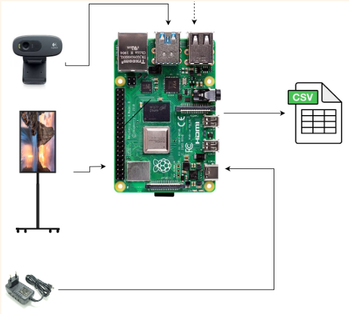
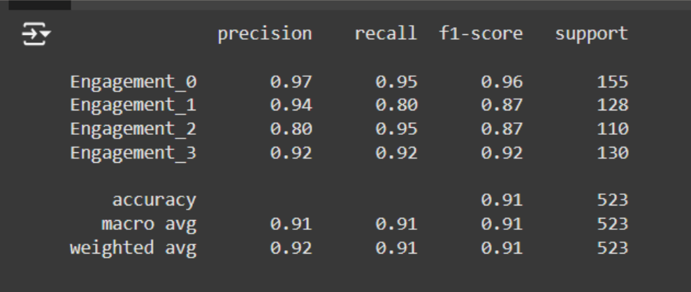
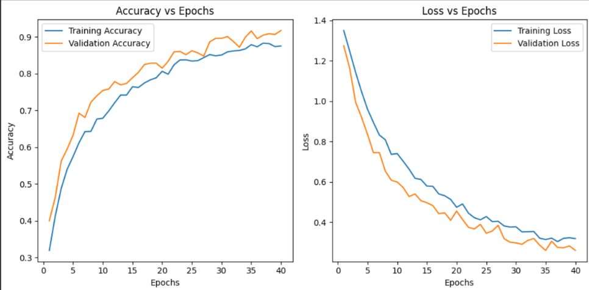
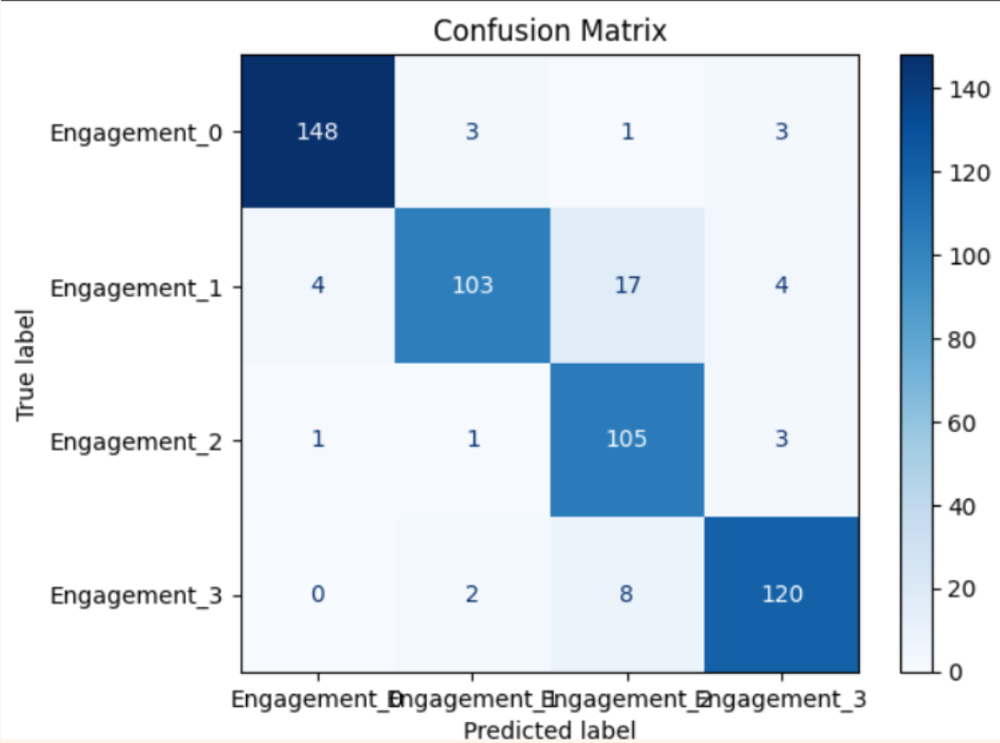

# Proyek Akhir Edge Intelligence Computing: Implementasi Deteksi Engagement terhadap Video Iklan di ruang publik Menggunakan CNN Berbasis Raspberry Pi

## Anggota Kelompok
1. Mochamad Elvindo (215150307111008)
2. Adimas Irfannanto (215150307111020)
3. Aikal Ichsan Alqadri (215150307111014)
4. Jason (215150300111021)
5. Muhammad Dzaky Amiruddin (215150307111033)

## Deskripsi Proyek
Proyek akhir kami merupakan implementasi model CNN menggunakan Raspberry Pi 4 untuk mendeteksi engagement pada konsumen atau manusia yang menonton video iklan. Raspberry Pi terhubung secara nirkabel menggunakan VNC untuk memberikan UI Raspberry Pi pada laptop yang digunakan. Pertama akan memulai recording yang akan memuat Model untuk mendeteksi setiap frame yang ada pada feed webcam yang kemudian diklasifikasi menjadi engagement 0, 1, 2, dan 3 dimana kelas 0 dan 1 digabung menjadi low engagement, serta kelas 2 dan 3 digabung menjadi high engagement. Setelah mengakhiri recording, akan ditampilkan ringkasan dari jumlah semua frame kelas yang telah ditangkap untuk user menentukan apakah konsumen atau orang tersebut memiliki high engagement atau low engagement terkait video iklan yang telah ditonton. Sistem ini bertujuan untuk memberikan feedback kepada tim marketing perusahaan terkait iklan mereka dapat menarik perhatian konsumen dengan waktu menonton yang tinggi.

## Rumusan Masalah
1. Bagaimana hasil implementasi metode CNN dalam mengklasifikasikan engagement pengguna?
2. Berapa tingkat akurasi yang di dapat saat diterapkan pada metode CNN dalam mengklasifikasikan engagement pengguna?
3. Bagaimana hasil Implementasi metode CNN dalam mengklasifikasikan engagement berbasis raspberry Pi?

## Tujuan
1. Mengidentifikasi hasil implementasi metode CNN dalam mengklasifikasikan engagement pengguna.
2. Mengidentifikasi tingkat akurasi yang di dapat saat diterapkan pada metode CNN dalam mengklasifikasikan engagement pengguna.
3. Mengidentifikasi hasil implementasi metode CNN dalam mengklasifikasikan engagement berbasis raspberry Pi.

## Perancangan Alat

## Dataset
Berikut ini merupakan beberapa sample data dari dataset yang kelompok kami ambil
| Gambar | Kelas Engagement |
| ------ | ---------------- |
|  | 0 |
|  | 0 |
|  | 0 |
|  | 1 |
|  | 1 |
|  | 1 |
|  | 2 |
|  | 2 |
|  | 2 |
|  | 3 |
|  | 3 |
|  | 3 |

## Evaluasi Model
Berikut ini merupakan hasil dari evaluasi model yang kami buat

